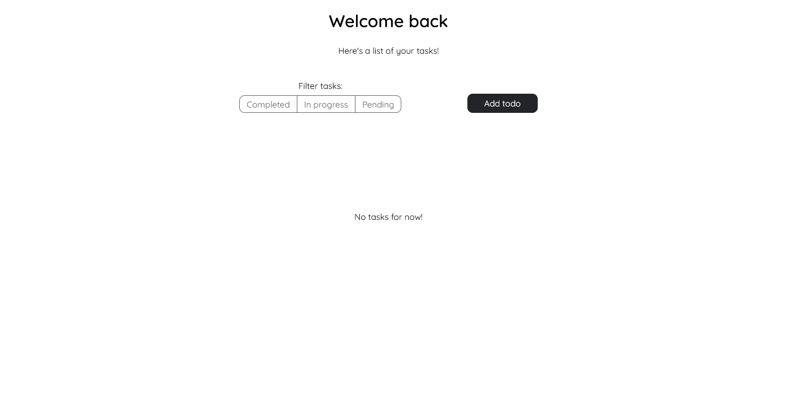
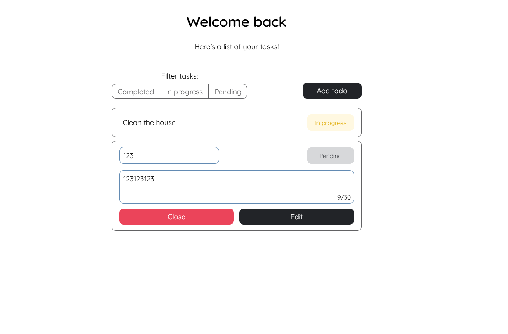

Создать todo компонент, основные технологии react, ts, redux, scss или любой другой препроцессор.
Остальные технологии и дизайн на ваше усмотрение.

Задача: Весь нижеперечисленный функционал должен работать с redux хранилищем. Счетчик, статус задач и т.д.
Функционал должен включать в себя

1. Добавление новой задачи
2. Добавление описания для каждой задачи
3. Новая задача добавляется с условием что ее длинна меньше или равна 30
4. Отображение списка добавленных записей
5. Переключение статуса записи любым способом, Выполнено/В работе/Ожидание
6. Фильтрация по статусу на toggle кнопку
7. Отображение счетчика выполненных задач.
   Главное условие, для выполненных задач нужно написать шаблон RTK query запроса который отправляет json со списком названий всех выполненных задач,
   моковые серверы использовать не нужно, только шаблон запроса, желательно добавить createAsyncThunk.

# Использованные технологии

- React (Vite)
- Redux Toolkit
- SASS
- FSD - [Feature Sliced Design](https://feature-sliced.design/) (Архитектура проекта)

# Демонстрация






## Основные функции

Основная логика взаимодействия с redux store находится в папке [tasks/model](./src/entities/task/model/)

- [Добовление задач](./src/features/add-task)
- [Редактирование](./src/entities/task/)
- [Фильтрация по статусу](./src/features/task-filter)

# Установка

```
npm i && npm run dev
```
